# Single Node OpenShift

## Summary
A Single Node OpenShift(SNO) is a configuration of a standard OpenShift with a single control plane node that is configured to run workloads on it. It offers both control and worker node functionality, users can deploy this smaller OpenShift footprint and have minimal to no dependence on the centralized management cluster and can run autonomously when needed. It can be deployed to resource-constrained environments for demos, proof of concepts, or even on-premises edge deployments. .

## Highlights
- Requires installation via openshift installer (IPI) or Assisted Installer. [Assisted Installer](https://docs.openshift.com/container-platform/4.10/installing/installing_sno/install-sno-installing-sno.html) uses installation wizard on Red Hat’s OpenShift Cluster Manager site.
- Local storage can be configured using [ODS LVM Operator](https://github.com/red-hat-storage/lvm-operator)
- You need entitement for the official support.

If you want to use Persistent Volumes, you’ll need an additional disk, an SSD preferably, and configre ODS LVM Operator to use it. 

## When to use Single Node OpenShift?
If you want to experience a “real” cluster, a Single Node OpenShift may be a better option. You can develop and deploy applications and get a real cluster feel.
It’s the best “small” OpenShift experience. 

I have Single Node OpenShift running on a baremetal environment with 16 Cores, 64GB RAM and 2 SSDs with MAS 8.9 and Manage 8.5. The first SSD has the OS, and the second disk is configured to be used by the LVM Operator.

## Use Cases
- Small MAS and Manage-only implementations that range from 10-30 users
- Satellite / Disconnected deployments, possibly connected to a big MAS. It can sync data to Central Data Center for Maximo EAM

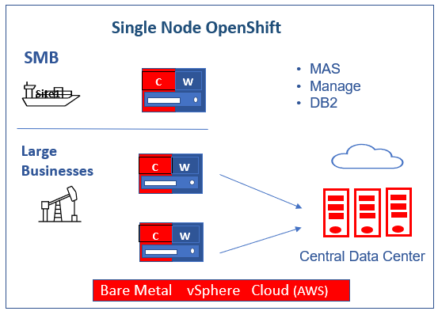

## Requirements
- OpenShift: 4.10+
- vCPU: 16Cores
- RAM: 64Gb
- IBM entitlement Key : Log in to the [IBM Container Library](https://myibm.ibm.com/products-services/containerlibrary) with a user ID that has software download rights for your company’s Passport Advantage entitlement to get the entitlement key.
- Openshift pull secret file (pull-secret). It can be downloaded from [here] (https://access.redhat.com/management). You need a valid redhat account for downloading.
- MAS license file (license.dat): Access [IBM License Key Center](https://licensing.subscribenet.com/control/ibmr/login) to the *Get Keys* menu select *IBM AppPoint Suites*. Select `IBM MAXIMO APPLICATION SUITE AppPOINT LIC.`  more details can be found in [here](https://ibm-mas.github.io/ansible-devops/playbooks/oneclick-core/#2-mas-license-file)
- Docker/Podman   
- AWS
    - Valid AWS access key id 
    - Secret access key: If you don't it, ask your aws account admin to create one in IAM service
    - Domain or subdomain: If you don't have one, ask your aws account admin to register one through AWS Route53
- Bare metal/vSphere: 
    - Requirements [link](https://access.redhat.com/documentation/en-us/openshift_container_platform/4.10/html/installing/installing-on-a-single-node#install-sno-requirements-for-installing-on-a-single-node_install-sno-preparing)

## Openshift Installation
- Set up IBM MAS DevOps ansible collection docker container

```   
mkdir ~/sno
cd ~/sno
docker pull quay.io/ibmmas/cli
docker run -dit --name sno quay.io/ibmmas/cli:latest bash

```

- Log into the docker container; create a folder for mas configuration; then exit the container

```
docker exec -it sno bash
mkdir masconfig
exit
```

- Copy pull-secret and mas license file into the docker container

```
docker cp pull-secret sno:/mascli/masconfig/pull-secret
docker cp license.dat sno:/mascli/masconfig/license.dat
```

### AWS

- Log into docker container
```
docker exec -it sno bash

Available commands:
  - mas install to launch a MAS install pipeline
  - mas provision-fyre to provision an OCP cluster on IBM DevIT Fyre (internal)
  - mas provision-roks to provision an OCP cluster on IBMCloud Red Hat OpenShift Service (ROKS)
  - mas provision-aws to provision an OCP cluster on AWS
  - mas provision-rosa to provision an OCP cluster on AWS Red Hat OpenShift Service (ROSA)
  - mas setup-registry to setup a private container registry on an OCP cluster
  - mas mirror-images to mirror container images required by mas to a private registry
  - mas configure-ocp-for-mirror to configure a cluster to use a private registry as a mirror
```

- Run the command to provision SNO AWS Cluster. It will automatically detect the single enode. 
- Enter your AWS credentials:
  - AWS API Key ID
  - AWS Secret Access Key
  - AWS Secret Access Key
  - Cluster Name
  - AWS Region
  - AWS Base Domain
  
```
mas provision-aws

IBM Maximo Application Suite AWS Cluster Provisioner
Powered by https://github.com/ibm-mas/ansible-devops/

 
AWS Access Key ID
Provide your AWS API Key ID (if you have not set the AWS_ACCESS_KEY_ID
environment variable) which will be used to provision an AWS instance.
AWS API Key ID > AKIAWKXUCZ55STYXXX
 
AWS Secret Access Key
Provide your AWS Secret Access Key (if you have not set the AWS_SECRET_ACCESS_KEY
environment variable) which will be used to provision an AWS instance.

AWS Secret Access Key > HiIoMnhB13tKthkiBlXvpJM9g/znKKlCgJoyxxxx
Re-use saved AWS Secret Access Key Starting 'HiIoMnhB13tKthkiBlXvpJM9g/znKKlCgJoyxxxx'? [Y/n] 
 
AWS Cluster Configuration
Cluster Name > sno
AWS Region > us-east-2
AWS Base Domain > buyermas4aws.com
Do you want single node openshift  [Y/n] 
 
OCP Version:
  1. 4.10 EUS (MAS 8.9)
Select Version > 1
 
Proceed with these settings [y/N] y

```
- You see the following message for your cluster after it is provisioned.

```
AWS cluster is ready to use
Connected to OCP cluster: https://console-openshift-console.apps.sno.buyermas4aws.com

```
	
### Bare Metal/vSphere

- OpenShift Container Platform(OCP) installation on a single node instructions [Link](https://access.redhat.com/documentation/en-us/openshift_container_platform/4.10/html/installing/installing-on-a-single-node)

#### Image Registry
  
    Ensure that your registry is set to managed to enable building and pushing of images. Here is the link for [configuring the registry for bare metal](https://docs.openshift.com/container-platform/4.8/registry/configuring_registry_storage/configuring-registry-storage-baremetal.html#configuring-registry-storage-baremetal)
   - Run

    ```
    $ oc edit configs.imageregistry/cluster
    ```

   - Then, change the line

    ```
    managementState: Removed
    ```
    
    to

    
    ```
    managementState: Managed
    ```

#### Route

## Storage Class

- Local storage in Kubernetes means storage devices or filesystems available locally on a node server. Install [LVM-Operator](https://github.com/red-hat-storage/lvm-operator)

!!! note
    You’ll need an additional disk, an SSD preferably, and configre ODS LVM Operator to use it.

You can install LVM operator from operator hub.

- Install ODF LVM Operator from OperatorHub

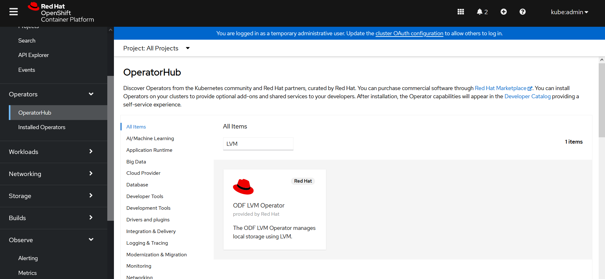

- Click on the tile and install 

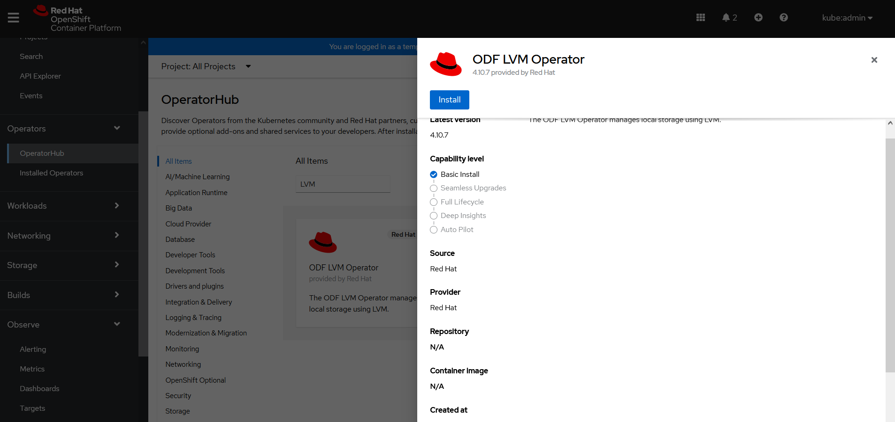

- Click Install

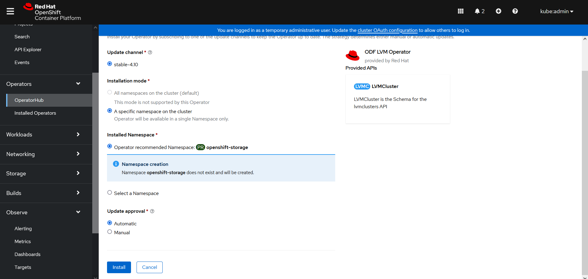

- After the operator is installed, click on `View Operator`

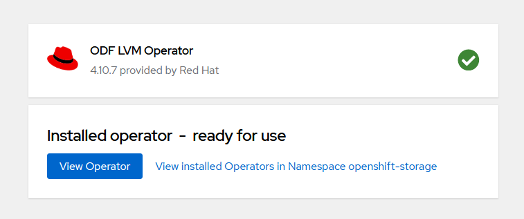

- Create LVM Operator Instance

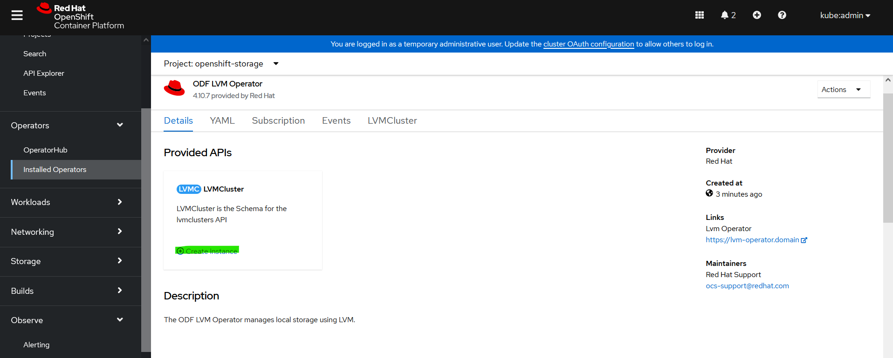

- Configure the instance

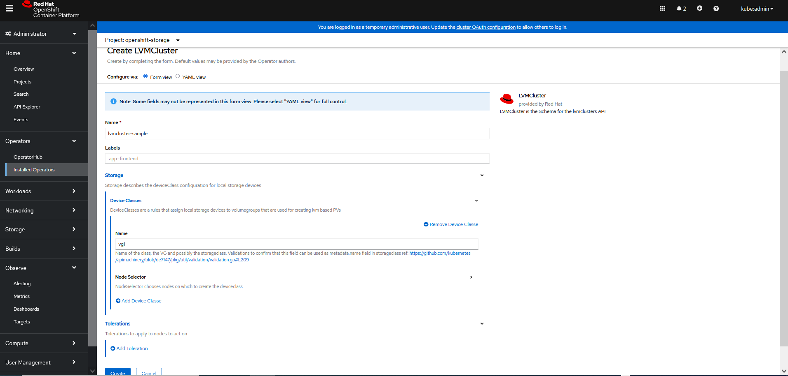

- After Configuration, the LVM storage class is created

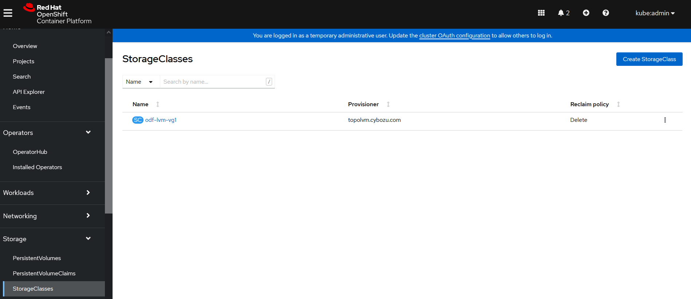

 
 
## MAS and Manage Installation

- *OC Login* : oc login --token=xxxx --server=<https://myocpserver>

Replace `xxxx` with your OpenShift token and `https://myocpserver` with your OpenShift Server.
You can get OC Login information from OpenShift Console (top right corner `kube:admin` drop down list, select `Copy login command`)

```

$ oc login --token=sha256~lt1uU_p_pXkBazB-DRh7-P5EVWvL1Drwvlu8o_G21u0 --server=https://api.sno4.sarika.donatelli.click:6443
The server uses a certificate signed by an unknown authority.
You can bypass the certificate check, but any data you send to the server could be intercepted by others.
Use insecure connections? (y/n): y

Logged into "https://api.sno4.sarika.donatelli.click:6443" as "kube:admin" using the token provided.

You have access to 76 projects, the list has been suppressed. You can list all projects with 'oc projects'

Using project "default".
Welcome! See 'oc help' to get started.

```
- mas install

```
mas install

IBM Maximo Application Suite Installer
Powered by https://github.com/ibm-mas/ansible-devops/ and https://tekton.dev/

Current Limitations
1. Support for airgap installation is limited to MAS 8.8 (core only) at present


1. Set Target OpenShift Cluster
Connected to OCP cluster:
   https://console-openshift-console.apps.sno4.sarika.donatelli.click
Connect to a different cluster [y/N] N 

2. Install OpenShift Pipelines Operator
OpenShift Pipelines Operator is installed and ready ... 

3. Configure Installation
MAS Instance ID > sno
Use online catalog? [y/N] y 
MAS Version:
  1. 8.9
Select Subscription Channel > 1
 
Info: SNO_MODE was not detected.
Do you want manage demodata to be loaded or not  [Y/n] N 

Info: SNO_MODE was detected.
Do you want manage demodata to be loaded or not  [Y/n] Y 

4. Configure Domain & Certificate Management
Configure Custom Domain [y/N] N 

5. Application Selection
Install Manage [y/N] y 

6a. Configure Storage Class Usage
Maximo Application Suite and it's dependencies require storage classes that support ReadWriteOnce (RWO) access mode:
  - ReadWriteOnce volumes can be mounted as read-write by multiple pods on a single node.

  - SNO MODE is set to true

Select the ReadWriteOnce storage classes to use from the list below:
 - odf-lvm-vg1

ReadWriteOnce (RWO) storage class > odf-lvm-vg1

6b. DB2 Storage size, in Gi(Gigabytes)
Size of data persistent volume > 20Gi
Size of temporary persistent volume > 10Gi
Size of metadata persistent volume > 10Gi
Size of transaction logs persistent volume > 10Gi
Size of backup persistent volume > 10Gi

7. Configure IBM Container Registry
czYWZkOWRkMDNkNjJjIn0.aRsAu30HTYJ0aYUJ4hB46GAmgK6nCu9ZBDTF_mQ6jAoV0cGxhY2UiLCJpYXQiOjE1ODM0NjIwODMsImp0aSI6ImNxxxxxxxxxxxxxxxxx
 
8. Configure Product License
License ID > 0242ac11xxxx
License File > /opt/app-root/src/masconfig/license.dat
 
9. Configure UDS
UDS Contact Email > snouser@ibm.com
UDS Contact First Name > sno
UDS Contact Last Name > sno
 
10. Prepare Installation
If you are using using storage classes that utilize 'WaitForFirstConsumer' binding mode choose 'No' at the prompt below

Wait for PVCs to bind? [Y/n] n 
 
Namespace 'mas-inst1-pipelines' is ready

Installed Task Definitions
NAME                                    IMAGE
mas-devops-appconnect                   quay.io/ibmmas/cli:latest
mas-devops-cert-manager                 quay.io/ibmmas/cli:latest
mas-devops-cluster-monitoring           quay.io/ibmmas/cli:latest
mas-devops-common-services              quay.io/ibmmas/cli:latest
mas-devops-cos                          quay.io/ibmmas/cli:latest
mas-devops-cp4d                         quay.io/ibmmas/cli:latest
mas-devops-cp4d-service                 quay.io/ibmmas/cli:latest
mas-devops-db2                          quay.io/ibmmas/cli:latest
mas-devops-gencfg-workspace             quay.io/ibmmas/cli:latest
mas-devops-ibm-catalogs                 quay.io/ibmmas/cli:latest
mas-devops-kafka                        quay.io/ibmmas/cli:latest
mas-devops-mongodb                      quay.io/ibmmas/cli:latest
mas-devops-nvidia-gpu                   quay.io/ibmmas/cli:latest
mas-devops-sbo                          quay.io/ibmmas/cli:latest
mas-devops-sls                          quay.io/ibmmas/cli:latest
mas-devops-suite-app-config             quay.io/ibmmas/cli:latest
mas-devops-suite-app-install            quay.io/ibmmas/cli:latest
mas-devops-suite-app-upgrade            quay.io/ibmmas/cli:latest
mas-devops-suite-config                 quay.io/ibmmas/cli:latest
mas-devops-suite-db2-setup-for-manage   quay.io/ibmmas/cli:latest
mas-devops-suite-dns                    quay.io/ibmmas/cli:latest
mas-devops-suite-install                quay.io/ibmmas/cli:latest
mas-devops-suite-mustgather             quay.io/ibmmas/cli:latest
mas-devops-suite-upgrade                quay.io/ibmmas/cli:latest
mas-devops-suite-verify                 quay.io/ibmmas/cli:latest
mas-devops-uds                          quay.io/ibmmas/cli:latest

Installed Pipeline Definitions
NAME          AGE
mas-install   4s
mas-update    4s
mas-upgrade   4s

quay.io/ibmmas/cli:latest is available from the target OCP cluster
 
11. Review Settings

    IBM Maximo Application Suite
    Instance ID ............... sno
    Catalog Source ............ ibm-operator-catalog
    Subscription Channel ...... 8.9.x
    IBM Entitled Registry ..... cp.icr.io/cp
    IBM Open Registry ......... icr.io/cpopen
    Entitlement Username ...... cp
    Entitlement Key ........... eyJhbGci<snip>
 
    IBM Maximo Application Suite Applications
    IoT ...................... Skip Installation
     - Monitor ............... Skip Installation
     - Safety ................ Skip Installation
    Manage ................... ibm-operator-catalog/8.5.x
     - Predict ............... Skip Installation
    Optimizer ................ Skip Installation
    H & P Utilities .......... Skip Installation
    Assist ................... Skip Installation
    MVI ...................... Skip Installation
 
    IBM Suite License Service
    Catalog Source ............ ibm-operator-catalog
    License ID ................ 0242ac11xxxx
    License File .............. /workspace/entitlement/license.dat
    IBM Entitled Registry ..... cp.icr.io/cp
    IBM Open Registry ......... icr.io/cpopen
    Entitlement Username ...... cp
    Entitlement Key ........... eyJhbGci<snip>
 
    IBM User Data Services
    Contact Email ............. sno@ibm.com
    First Name ................ sno
    Last Name ................. sno
 
    IBM Cloud Pak Foundation Services
    Catalog Source ............ ibm-operator-catalog

 
Proceed with these settings [y/N] y
 
12. Launch Installation
Installation started successfully

View progress:
  https://console-openshift-console.apps.sno.buyermas4aws.com/pipelines/ns/mas-sno-pipelines
 
```

## Tekton Pipeline

You can see the installation progess and logs from OpenShift Console in the mas-<workspaceid>-pipelines namespace. Select Pipelines menu in the left navigation bar and click on  on PipelinesRuns tab and select pipeline run. You can click on any task and view logs.
 
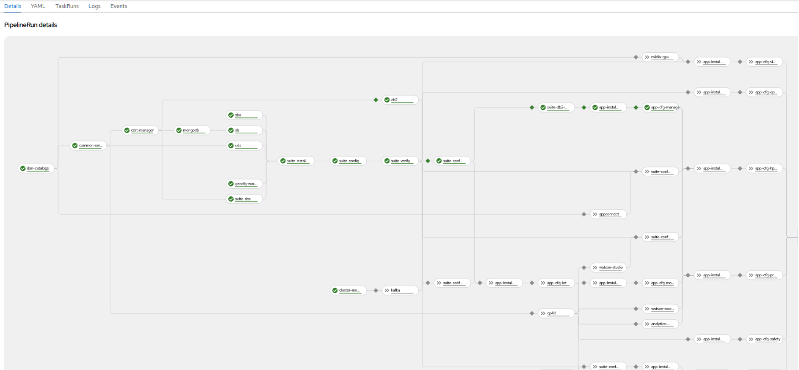
	

## Manage Installation (without DB2)

- If you want to use an existing external database, install the Manage app and configure the database using the following steps (MAS admin dashboard):
	 
	- Go to MAS admin UI.
		- From OpenShift Console, go to Routes. Select Admin dashboard. Click on Locations to go MAS admin dashboard.
		
		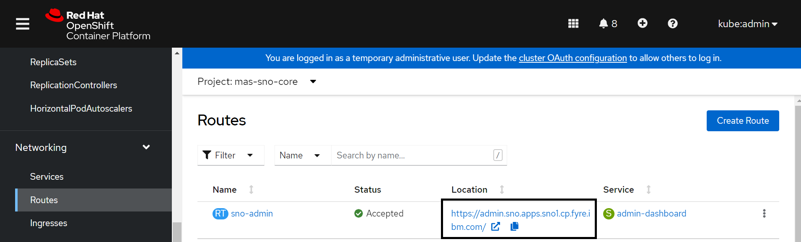
		
		- Make sure you can connect to coreapi service route.
		
		- Get the superuser password from `mas-sno-core` project secrets to log in to the MAS admin dashboard.
		
		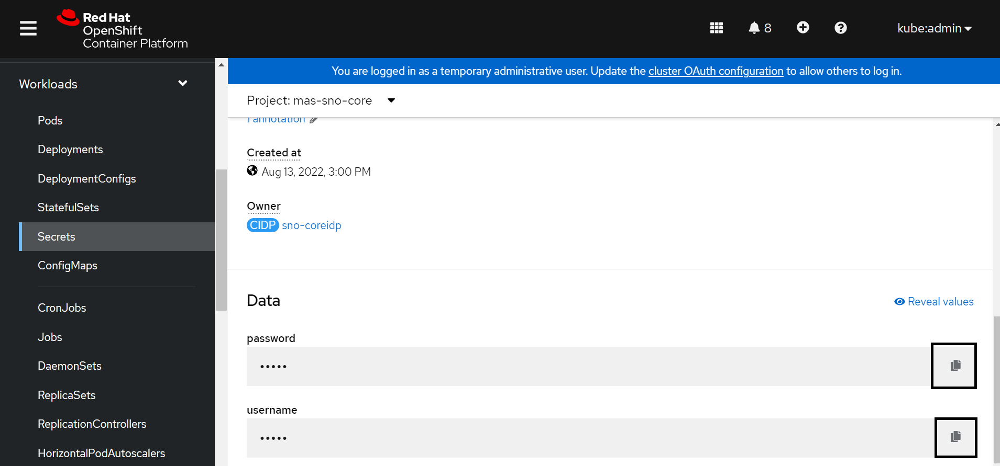
		
		- Create an authorized admin user using `Users` page. For example, masadmin
		
		
		 
		- Login as admin user `masadmin` created in the previous step. Install Manage from the catalog page.
		
		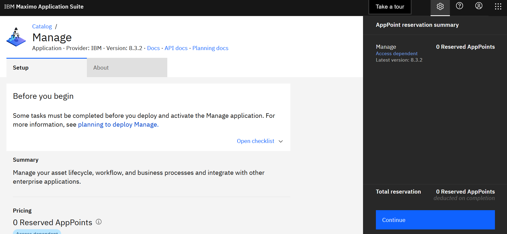
		 
		- Select `Application version` action to deploy operator.
		
		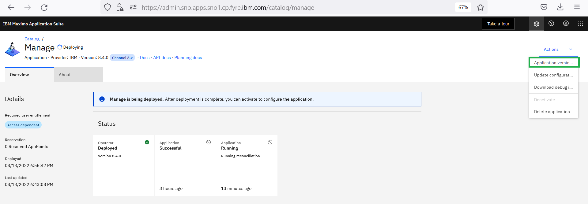
		
		- Select subscription 
		
		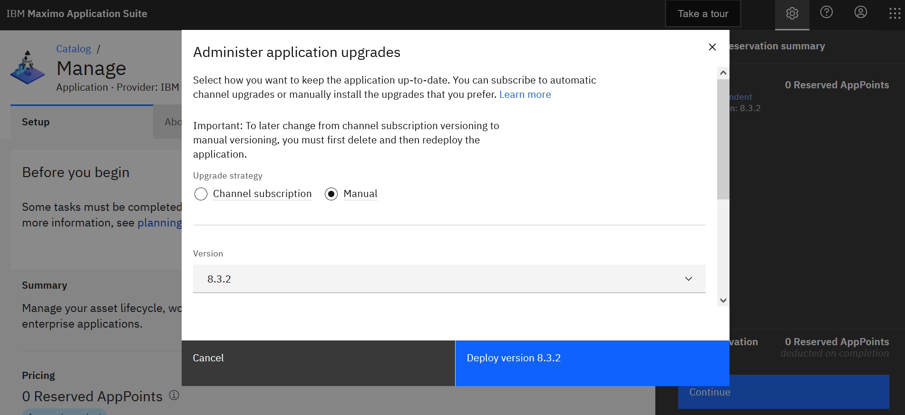
		
		- After deployment is complete, select `Update configuration` by selecting the action from the top right corner of the page:
		
		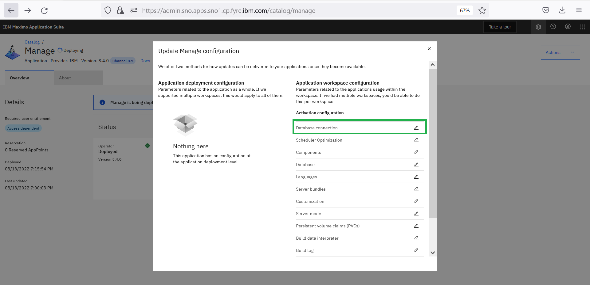
		 
		- Update database connection:
		
		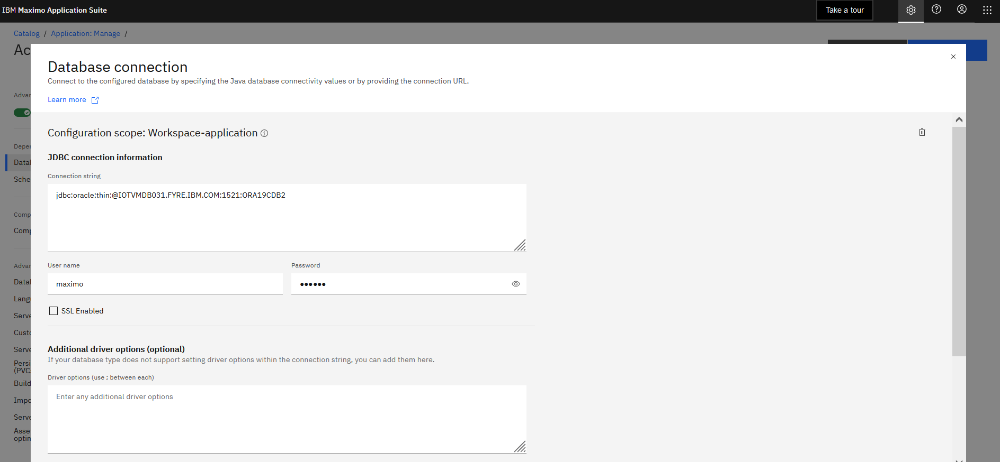
		 
		- Update database configuration. Select `Install Demo Data` if want to add maxdemo data.
		
		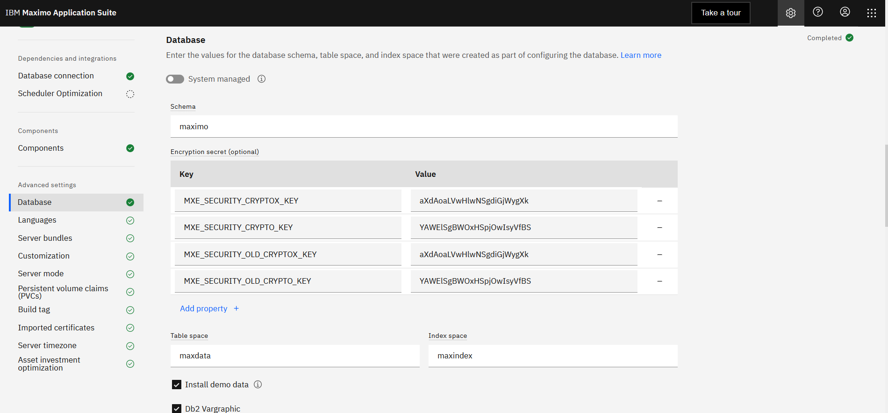
		
		- Apply changes by clicking on the blue `Activate` button in the top right.
		
		- After successful activation, the `Manage` app can be accessed by clicking on the nine-dot menu in the top right corner.

