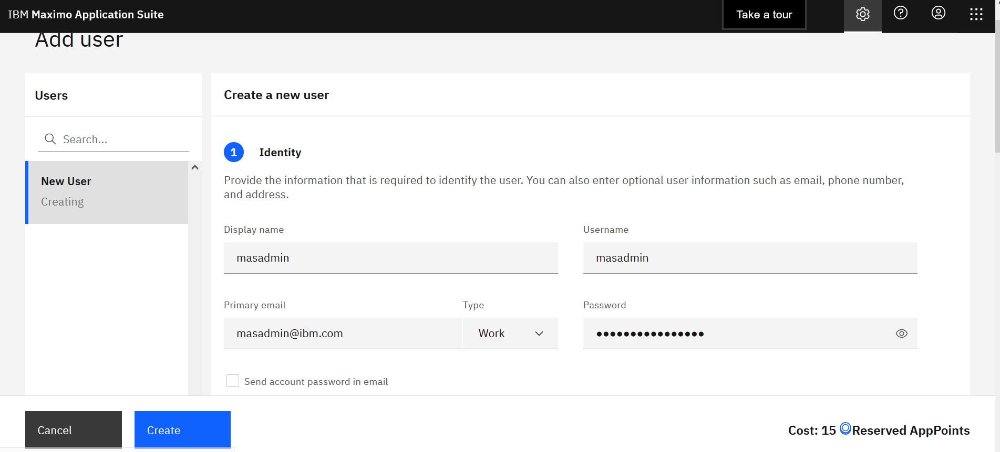

# Single Node OpenShift (OpenShift 4.10+) 

## Summary
A Single Node OpenShift(SNO) is a configuration of a standard OpenShift with a single control plane node that is configured to run workloads on it. It offers both control and worker node functionality, users can deploy this smaller OpenShift footprint and have minimal to no dependence on the centralized management cluster and can run autonomously when needed. It can be deployed to resource-constrained environments for demos,
 proof of concepts, or even on-premises edge deployments. It has limited resources.

## Highlights
- Requires installation via openshift installer (IPI) or Assisted Installer. [Assisted Installer](https://docs.openshift.com/container-platform/4.10/installing/installing_sno/install-sno-installing-sno.html) uses installation wizard on Red Hat’s OpenShift Cluster Manager site.
- Local storage can be configured using [ODS LVM Operator](https://github.com/red-hat-storage/lvm-operator)
- You need entitement for the official support.

If you want to use Persistent Volumes, you’ll need an additional disk, an SSD preferably, and configre ODS LVM Operator to use it. 

## When to use Single Node OpenShift?
If you want to experience a “real” cluster, a Single Node OpenShift may be a better option. You can develop and deploy applications and get a real cluster feel.
It’s the best “small” OpenShift experience. 

I have Single Node OpenShift running on a baremetal environment with 16 Cores, 64GB RAM and 2 SSDs with MAS 8.9 and Manage 8.5. The first SSD has the OS, and the second disk is configured to be used by the LVM Operator.

## Use Cases
- Small MAS and Manage-only implementations that range from 10-30 users
- Satellite / Disconnected deployments, possibly connected to a big MAS. It can sync data to Central Data Center for Maximo EAM


## Requirements
- vCPU: 16Cores
- RAM: 64Gb
- IBM entitlement Key : Log in to the [IBM Container Library](https://myibm.ibm.com/products-services/containerlibrary) with a user ID that has software download rights for your company’s Passport Advantage entitlement to get the entitlement key.
- Openshift pull secret file (pull-secret). It can be downloaded from [here] (https://access.redhat.com/management). You need a valid redhat account for downloading.
- MAS license file (license.dat): Access [IBM License Key Center](https://licensing.subscribenet.com/control/ibmr/login) to the *Get Keys* menu select *IBM AppPoint Suites*. Select `IBM MAXIMO APPLICATION SUITE AppPOINT LIC.`  more details can be found in [here](https://ibm-mas.github.io/ansible-devops/playbooks/oneclick-core/#2-mas-license-file)
- Docker/Podman   
- AWS
    - Valid AWS access key id 
    - Secret access key: If you don't it, ask your aws account admin to create one in IAM service
    - Domain or subdomain: If you don't have one, ask your aws account admin to register one through AWS Route53
- Bare metal/vSphere: 
    - Requirements [link](https://access.redhat.com/documentation/en-us/openshift_container_platform/4.10/html/installing/installing-on-a-single-node#install-sno-requirements-for-installing-on-a-single-node_install-sno-preparing)

## Openshift Installation
- Set up IBM MAS DevOps ansible collection docker container

```   
mkdir ~/sno
cd ~/sno
git clone https://github.com/ibm-mas/ansible-devops
docker run -dit -v ~/sno:/opt/app-root/src/sno --name sno quay.io/ibmmas/ansible-devops:latest bash​
docker exec -it sno bash
cd /opt/app-root/src/sno/ansible-devops/ibm/mas_devops
./rebuild.sh
exit
```

- Log into the docker container; create a folder for mas configuration; then exit the container

```
docker exec -it sno bash
mkdir /root/masconfig
exit
```

- Copy pull-secret and mas license file into the docker container


```
docker cp pull-secret sno:/root/masconfig/pull-secret
docker cp license.dat sno:/root/masconfig/license.dat
```

### AWS

- Log into docker container, set env variables, then run playbook to provision SNO Cluster

```
docker exec -it sno bash

export AWS_ACCESS_KEY_ID="<your aws access key id"
export AWS_SECRET_ACCESS_KEY="<your aws secret access key"
export IPI_PLATFORM=aws
export CLUSTER_TYPE="ipi"
export CLUSTER_NAME=<cluster name e.g. sno>
export IPI_REGION=<aws region e.g. us-east-1?
export IPI_BASE_DOMAIN=<your domain>
export IPI_PULL_SECRET_FILE="/root/masconfig/pull-secret"
export IPI_DIR="/root/sno"
export IPI_CONTROLPLANE_REPLICAS=1
export IPI_COMPUTE_REPLICAS=0
export OCP_VERSION="latest-4.10"

ansible-playbook ibm.mas_devops.ocp_aws_provision

```
	
### Bare Metal/vSphere

- OpenShift Container Platform(OCP) installation on a single node [instructions](https://access.redhat.com/documentation/en-us/openshift_container_platform/4.10/html/installing/installing-on-a-single-node)

**Image Registry**
  Ensure that your registry is set to managed to enable building and pushing of images. Here is the link for [configuring the registry for bare metal]  (https://docs.openshift.com/container-platform/4.8/registry/configuring_registry_storage/configuring-registry-storage-baremetal.html#configuring-registry-storage-baremetal)
   - Run

    ```
    $ oc edit configs.imageregistry/cluster
    ```

   - Then, change the line

    ```
    managementState: Removed
    ```
    
    to

    
    ```
    managementState: Managed
    ```


## Storage Class

- Local storage in Kubernetes means storage devices or filesystems available locally on a node server. Install [LVM-Operator]] (https://github.com/red-hat-storage/lvm-operator)

!!! note
    You’ll need an additional disk, an SSD preferably, and configre ODS LVM Operator to use it.

You can install LVM operator from operator hub.

- Install ODF LVM Operator from OperatorHub


- Click on the tile and install 


- Click Install


- After the operator is installed, click on `View Operator`


- Create LVM Operator Instance


- Configure the instance


- After Configuration, the LVM storage class is created


 
## Install MAS and Manage

*OC Login*
```
oc login --token=xxxx --server=<https://myocpserver>
```

Replace `xxxx` with your OpenShift token and `https://myocpserver` with your OpenShift Server.
You can get OC Login information from OpenShift Console (top right corner `kube:admin` drop down list, select `Copy login command`)

- Set up environment variables

```
export MONGODB_STORAGE_CLASS=<storage-class>
export IBM_ENTITLEMENT_KEY=<entitlement-key>
export MAS_APP_ID=manage
export SLS_ENTITLEMENT_KEY=<entitlement-key>
export SLS_STORAGE_CLASS=<storage-class>
export SLS_LICENSE_ID=<license-id>
export SLS_LICENSE_FILE=<license-file>
export UDS_STORAGE_CLASS=<storage-class>
export UDS_CONTACT_EMAIL=<your email-id>
export UDS_CONTACT_FIRSTNAME=<your first name>
export UDS_CONTACT_LASTNAME=<your first name>
export MAS_INSTANCE_ID=<instance-id>
export MAS_CONFIG_DIR=<config-dir>
export MAS_WORKSPACE_ID=<mas-workspace-id>
export MAS_ENTITLEMENT_KEY=<entitlement-key>
export PROMETHEUS_STORAGE_CLASS=<storage-class>
export PROMETHEUS_ALERTMGR_STORAGE_CLASS=<storage-class>
export GRAFANA_INSTANCE_STORAGE_CLASS=<storage-class>
export MONGODB_REPLICAS=1
```

!!! note
    How to get the `IBM Entitlement key` and `SLS License file` check [preparation link](https://ibm-mas.github.io/ansible-devops/playbooks/oneclick-core/#preparation)
		
Sample environment variables:

```
export MAS_APP_ID=manage
export SLS_LICENSE_ID=0242ac110002 
export SLS_LICENSE_FILE=~/masconfig/entitlement.lic
export UDS_CONTACT_EMAIL=abc@us.ibm.com
export UDS_CONTACT_FIRSTNAME=abc
export UDS_CONTACT_LASTNAME=abc
export MAS_INSTANCE_ID=sno
export MAS_CONFIG_DIR=~/masconfig
export MAS_WORKSPACE_ID=masdev
export MAS_INSTANCE_ID=sno
export MONGODB_REPLICAS=1
```

AWS Storage class
```
export MONGODB_STORAGE_CLASS=gp2 
export SLS_STORAGE_CLASS=gp2
export UDS_STORAGE_CLASS=gp2
export PROMETHEUS_STORAGE_CLASS=gp2
export PROMETHEUS_ALERTMGR_STORAGE_CLASS=go2
export GRAFANA_INSTANCE_STORAGE_CLASS=gp2

```	

!!! note
    `gp2` is the default storage class in AWS. You can optionally install RedHat LVM (Logical Volume Manager) operator using OperatorHub for volume management.

```
export PROMETHEUS_ALERTMGR_STORAGE_CLASS=odf-lvm-vg1
export UDS_STORAGE_CLASS=odf-lvm-vg1
export MONGODB_STORAGE_CLASS=odf-lvm-vg1
export GRAFANA_INSTANCE_STORAGE_CLASS=odf-lvm-vg1
export SLS_STORAGE_CLASS=odf-lvm-vg1
export PROMETHEUS_STORAGE_CLASS=odf-lvm-vg1

```

- Run ansible playbook to install MAS core and dependencies. It takes about 1.5 hours to complete the installation. Some tasks takes more time to complete and you will see `Failed - Retrying...` messages.
	
```
ansible-playbook playbooks/oneclick_core.yml
```

!!! note
    Check out [MAS Ansible Devops Documentation](https://ibm-mas.github.io/ansible-devops/) for more information


## Intall DB2 (optional)

Install DB2 using this [Db2 link](https://ibm-mas.github.io/ansible-devops/roles/db2/)

Sample environment variables:
	
```
export DB2_BACKUP_STORAGE_ACCESSMODE=READWRITEONCE
export DB2_META_STORAGE_ACCESSMODE=READWRITEONCE

export DB2_META_STORAGE_SIZE=10Gi  
export DB2_BACKUP_STORAGE_SIZE=10Gi  
export DB2_LOGS_STORAGESIZE=10Gi 
export DB2_TEMP_STORAGE_SIZE=10Gi
export DB2_DATA_STORAGE_SIZE=20Gi
export DB2_CPU_REQUESTS=300m
```

AWS storage class
```
export DB2_META_STORAGE_CLASS=gp2
export DB2_DATA_STORAGE_CLASS=gp2
export DB2_BACKUP_STORAGE_CLASS=gp2
export DB2_LOGS_STORAGE_CLASS=gp2
export DB2_TEMP_STORAGE_CLASS=gp2
```

Bare Metal/vSphere storage class
```
export DB2_META_STORAGE_CLASS=odf-lvm-vg1
export DB2_DATA_STORAGE_CLASS=odf-lvm-vg1
export DB2_BACKUP_STORAGE_CLASS=odf-lvm-vg1
export DB2_LOGS_STORAGE_CLASS=odf-lvm-vg1
export DB2_TEMP_STORAGE_CLASS=odf-lvm-vg1
```


## Install and Configure Manage

- You can run the following automation playbook to install DB2 and Manage. 

```
ansible-playbook playbooks/oneclick_add_manage.yml
```
	
- If you want to use an existing external database, install the Manage app and configure the database using the following steps (MAS admin dashboard):
	 
	- Go to MAS admin UI.
		- From OpenShift Console, go to Routes. Select Admin dashboard. Click on Locations to go MAS admin dashboard.
		
		
		
		- Make sure you can connect to coreapi service route.
		
		- Get the superuser password from `mas-sno-core` project secrets to log in to the MAS admin dashboard.
		
		
		
		- Create an authorized admin user using `Users` page. For example, masadmin
		
		
		 
		- Login as admin user `masadmin` created in the previous step. Install Manage from the catalog page.
		
		
		 
		- Select `Application version` action to deploy operator.
		
		
		
		- Select subscription 
		
		
		
		- After deployment is complete, select `Update configuration` by selecting the action from the top right corner of the page:
		
		
		 
		- Update database connection:
		
		
		 
		- Update database configuration. Select `Install Demo Data` if want to add maxdemo data.
		
		
		
		- Apply changes by clicking on the blue `Activate` button in the top right.
		
		- After successful activation, the `Manage` app can be accessed by clicking on the nine-dot menu in the top right corner.
