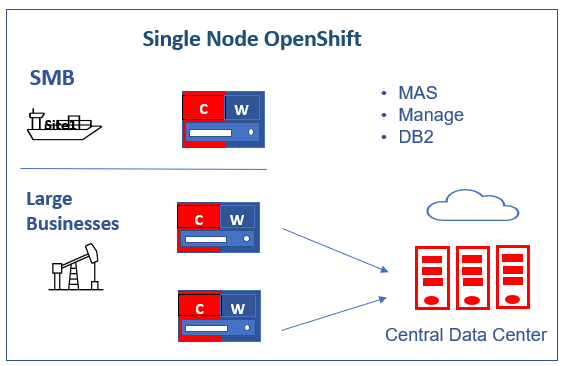

# Single Node OpenShift

## Summary
Single Node OpenShift (SNO) is a configuration of a standard OpenShift cluster that consists of a single control plane node that is configured to run workloads on it. This configuration offers both control and worker node functionality, allowing users to deploy a smaller OpenShift footprint and have minimal to no dependence on a centralized management cluster. SNO can run autonomously when needed, making it a useful solution for resource-constrained environments, demos, proof of concepts, or even on-premises deployments.

By deploying SNO, users can experience the benefits of OpenShift in a more compact environment that requires fewer resources. It can also provide a simple and efficient way to test new features or applications in a controlled environment. However, it's important to keep in mind that SNO lacks high availability, so it may not be suitable for mission-critical workloads that require constant uptime.

Overall, SNO offers a flexible and convenient way to deploy OpenShift for a variety of use cases.

## Highlights
- Automated SNO installation on AWS.
- Assisted Installer for SNO installation on bare metal and vSphere. The [Assisted Installer](https://docs.openshift.com/container-platform/4.10/installing/installing_sno/install-sno-installing-sno.html) uses a wizard on Red Hat’s OpenShift Cluster Manager site.
- Allows for local storage configuration using the ODS [ODS LVM Operator](https://github.com/red-hat-storage/lvm-operator). 
- Automates installation of MAS, Manage, Mobile, and DB2 using ansible-devops/CLI. 
- Generates JDBC Configuration for all three external databases(DB2, Oracle, SQL server) from CLI.
- Supports all valid combinations of industry solutions and add-ons on SNO based on the compatibility matrix.
- Supports 70 concurrent users.
- You need entitement for the official support.
- Supported on bare metal, vSphere, Red Hat OpenStack, and Red Hat Virtualization platforms.

If you want to use Persistent Volumes, you’ll need an additional disk, an SSD preferably, and configre ODS LVM Operator to use it. 

## When to use Single Node OpenShift?
- For edge sites or scenarios where OpenShift clusters are required, but high availability is not critical, Single Node OpenShift can be an appropriate solution.
- For developers who want to experience a "real" cluster environment, Single Node OpenShift is a good option. It enables them to develop and deploy applications in a cluster environment, providing a "small" OpenShift experience. 
- It's important to note that Single Node OpenShift lacks high availability, which is a tradeoff that should be considered.

I have Single Node OpenShift running on a baremetal environment with 16 Cores, 64GB RAM and 2 SSDs with MAS 8.10 and Manage 8.6. The first SSD has the OS, and the second disk is configured to be used by the LVM Operator.

## Use Cases
- Small MAS and Manage-only implementations that range from 70 concurrent users
- Satellite / Disconnected deployments, possibly connected to a big MAS. It can sync data to Central Data Center for Maximo EAM
- Upgrading small Maximo customers to MAS 
- Demo & PoC



## Requirements
- OpenShift: 4.10+
- vCPU: 16Cores
- RAM: 64Gb
- IBM entitlement Key : Log in to the [IBM Container Library](https://myibm.ibm.com/products-services/containerlibrary) with a user ID that has software download rights for your company’s Passport Advantage entitlement to get the entitlement key.
- Openshift pull secret file (pull-secret). It can be downloaded from [here] (https://access.redhat.com/management). You need a valid redhat account for downloading.
- MAS license file (license.dat): Access [IBM License Key Center](https://licensing.subscribenet.com/control/ibmr/login) to the *Get Keys* menu select *IBM AppPoint Suites*. Select `IBM MAXIMO APPLICATION SUITE AppPOINT LIC.`  more details can be found in [here](https://ibm-mas.github.io/ansible-devops/playbooks/oneclick-core/#2-mas-license-file)
- Docker/Podman   
- AWS
    - Valid AWS access key id 
    - Secret access key: If you don't it, ask your aws account admin to create one in IAM service
    - Domain or subdomain: If you don't have one, ask your aws account admin to register one through AWS Route53
- Bare metal/vSphere: 
    - Requirements [link](https://access.redhat.com/documentation/en-us/openshift_container_platform/4.10/html/installing/installing-on-a-single-node#install-sno-requirements-for-installing-on-a-single-node_install-sno-preparing)

## Openshift Installation
- Set up IBM MAS DevOps ansible collection docker container

```   
mkdir ~/sno
cd ~/sno
docker pull quay.io/ibmmas/cli
docker run -dit --name sno quay.io/ibmmas/cli:latest bash

```

- Log into the docker container; create a folder for mas configuration; then exit the container

```
docker exec -it sno bash
mkdir masconfig
exit
```

- Copy pull-secret and mas license file into the docker container

```
docker cp pull-secret sno:/mascli/masconfig/pull-secret
docker cp license.dat sno:/mascli/masconfig/license.dat
```

### AWS

- Log into docker container
```
docker exec -it sno bash

Available commands:
  - mas install to launch a MAS install pipeline
  - mas provision-fyre to provision an OCP cluster on IBM DevIT Fyre (internal)
  - mas provision-roks to provision an OCP cluster on IBMCloud Red Hat OpenShift Service (ROKS)
  - mas provision-aws to provision an OCP cluster on AWS
  - mas provision-rosa to provision an OCP cluster on AWS Red Hat OpenShift Service (ROSA)
  - mas setup-registry to setup a private container registry on an OCP cluster
  - mas mirror-images to mirror container images required by mas to a private registry
  - mas configure-ocp-for-mirror to configure a cluster to use a private registry as a mirror
```

- Run the command to provision SNO AWS Cluster. It will automatically detect the single enode. 
- Enter your AWS credentials:
  - AWS API Key ID
  - AWS Secret Access Key
  - AWS Secret Access Key
  - Cluster Name
  - AWS Region
  - AWS Base Domain
  
```
mas provision-aws

IBM Maximo Application Suite AWS Cluster Provisioner
Powered by https://github.com/ibm-mas/ansible-devops/

 
AWS Access Key ID
Provide your AWS API Key ID (if you have not set the AWS_ACCESS_KEY_ID
environment variable) which will be used to provision an AWS instance.
AWS API Key ID > AKIAWKXUCZ55STYXXX
 
AWS Secret Access Key
Provide your AWS Secret Access Key (if you have not set the AWS_SECRET_ACCESS_KEY
environment variable) which will be used to provision an AWS instance.

AWS Secret Access Key > HiIoMnhB13tKthkiBlXvpJM9g/znKKlCgJoyxxxx
Re-use saved AWS Secret Access Key Starting 'HiIoMnhB13tKthkiBlXvpJM9g/znKKlCgJoyxxxx'? [Y/n] 
 
AWS Cluster Configuration
Cluster Name > sno
AWS Region > us-east-2
AWS Base Domain > buyermas4aws.com
Do you want single node openshift  [Y/n] 
 
OCP Version:
  1. 4.10 EUS 
Select Version > 1
 
Proceed with these settings [y/N] y

```
- You see the following message for your cluster after it is provisioned.

```
AWS cluster is ready to use
Connected to OCP cluster: https://console-openshift-console.apps.sno.buyermas4aws.com

```
	
### Bare Metal/vSphere

#### Installation
- OpenShift Container Platform(OCP) installation on a single node instructions [link](https://access.redhat.com/documentation/en-us/openshift_container_platform/4.10/html/installing/installing-on-a-single-node)

#### Storage Class
- Local storage in OpenShift means storage devices or filesystems available locally on a node server. You need to provide the cluster with a storage class 
and related provisioner. 
- Install [LVM-Operator](https://github.com/red-hat-storage/lvm-operator) for local storage.

!!! note
    You’ll need an additional disk, an SSD preferably, and configre ODS LVM Operator to use it.

You can install LVM operator from operator hub.

- Install ODF LVM Operator from OperatorHub


- Click on the tile and install 


- Click Install


- After the operator is installed, click on `View Operator`


- Create LVM Operator Instance


- Configure the instance


- After Configuration, the LVM storage class is created


- Set the LVM storage class as the default:

    - In the OpenShift Console UI, go to Storage -> StorageClasses using the left menu. You should see `odf-lvm-vg1`.
    - Click on it, in the next screen click on the YAML tab.
    - Add storageclass.kubernetes.io/is-default-class: "true" under the annotations.

 
- The YAML should look like this:


```
kind: StorageClass
apiVersion: storage.k8s.io/v1
metadata:
  name: odf-lvm-vg1
  uid: 55909d9c-882c-4cbb-962d-e7dbed289946
  resourceVersion: '7200873'
  creationTimestamp: '2023-03-26T02:15:25Z'
  annotations:
    description: Provides RWO and RWOP Filesystem & Block volumes
    storageclass.kubernetes.io/is-default-class: 'true'
  managedFields:
provisioner: topolvm.cybozu.com
parameters:
  csi.storage.k8s.io/fstype: xfs
  topolvm.cybozu.com/device-class: vg1
reclaimPolicy: Delete
allowVolumeExpansion: true
volumeBindingMode: WaitForFirstConsumer
```

- You can also use CLI command to set the storageclass as the default:

```
oc patch storageclass odf-lvm-vg1 -p '{"metadata": {"annotations":{"storageclass.kubernetes.io/is-default-class":"true"}}}'
``` 

#### Enable Image Registry
You need to enable the image registry for building and pushing of images. Link: [configuring the registry for bare metal](https://docs.openshift.com/container-platform/4.8/registry/configuring_registry_storage/configuring-registry-storage-baremetal.html#configuring-registry-storage-baremetal)

- In the OpenShift Console UI, Home->Search for `config`


- Click `cluster`. Go to the `YAML` tab.  Click on the top right `Action` drop down and select `Edit Config`. 


- Update the cluster yaml:


    - Set managementState from `Removed` to `Managed`: 
  
    ```
    managementState: Removed
    ```
  
    to
  
    ```
    managementState: Managed
    ```
  
    - Set rolloutStrategy from 'RollingUpdate` to `Recreate`:
  
    ```
  
    rolloutStrategy: RollingUpdate
    ```
  
    to
  
    ```
    rolloutStrategy: Recreate
    ```

    - Set Storage:
  
    ```
    storage: {}
    ```
  
    to 
  
    ```
    storage:
      pvc:
        claim: ''
    ```    


You can also use  `oc edit` to update the cluster yaml using command line:

```
$ oc edit configs.imageregistry/cluster
```

Check if the `image-storage-registry` PVC is bound. If it is in pending status, please follow the steps in "Troubleshooting" section before installing MAS and Manage.


## MAS and Manage Installation

- Login to your OpenShift: Use the OpenShift Console top right pulldown menu to get the login command to OpenShift.


- Click on the `Copy login command`, the click on the “Display Token” word that will be shown in the page that just opened, and then copy the login command shown under `Log in with this token`:


```
$ oc login --token=sha256~lt1uU_p_pXkBazB-DRh7-P5EVWvL1Drwvlu8o_G21u0 --server=https://api.sno4.sarika.donatelli.click:6443
The server uses a certificate signed by an unknown authority.
You can bypass the certificate check, but any data you send to the server could be intercepted by others.
Use insecure connections? (y/n): y

Logged into "https://api.sno4.sarika.donatelli.click:6443" as "kube:admin" using the token provided.

You have access to 76 projects, the list has been suppressed. You can list all projects with 'oc projects'

Using project "default".
Welcome! See 'oc help' to get started.

```
- mas install

```

mas install

IBM Maximo Application Suite Installer
Powered by https://github.com/ibm-mas/ansible-devops/ and https://tekton.dev/

Current Limitations
1. Support for airgap installation is limited to MAS 8.8 (core only) at present


1. Set Target OpenShift Cluster
Connected to OCP cluster:
   https://console-openshift-console.apps.sno4.sarika.donatelli.click
Connect to a different cluster [y/N] N 

2. Install OpenShift Pipelines Operator
OpenShift Pipelines Operator is installed and ready ... 

3. Configure Installation
MAS Instance ID > sno
Use online catalog? [y/N] y 
MAS Version:
  1. 8.10
  2. 8.9
Select Subscription Channel > 1

3.1. License Terms
For information about your license, see   To continue with the installation, you must accept the license terms.
Do you accept the license terms? [y/N] y

4. Configure Operation Mode
Maximo Application Suite can be installed in a non-production mode for internal development and testing, this setting cannot be changed after installation:
 - All applications, add-ons, and solutions have 0 (zero) installation AppPoints in non-production installations.
 - These specifications are also visible in the metrics that are shared with IBM® and on the product UI.

Use non-production mode? [y/N] 

5. Configure Domain & Certificate Management
Configure Custom Domain [y/N]

6. Application Selection
Install IoT [y/N]
Install Manage [y/N] y
Custom Subscription Channel > 8.6.x-dev
+ Create demo data [Y/n]
+ Configure JMS [y/N]
+ Customize database settings [y/N] y
Schema > maximo
Tablespace > maximo
Indexspace > maximo
Install Optimizer [y/N]
Install Visual Inspection [y/N]
Install Predict [y/N]
Install Health & Predict - Utilities [y/N]
Install Assist [y/N]

7. Configure Db2
The installer can setup one or more IBM Db2 instances in your OpenShift cluster for the use of applications that require a JDBC datasource (IoT, Manage, Monitor, & Predict) or you may choose to configure MAS to use an existing database.

Install Db2 using the IBM Db2 Universal Operator? [Y/n] n

7.1 Database configuration for IoT
Maximo IoT requires a shared system-scope Db2 instance because others application in the suite require access to the same database source.
 - Only IBM Db2 is supported for this database

System Database configuration for IoT is not required because the application is not being installed

7.2 Database configuration for Manage
Maximo Manage can be configured to share the system Db2 instance or use it's own dedicated database.
 - IBM Db2, Oracle Database, & Microsoft SQL Server are all supported database options

Do you want to generate a dedicated JDBC configuration for Manage? [y/N] y

Select Local configuration directory > /mascli/masconfig
Configuration Display Name: jdbc-sb1-manage
JDBC Connection String: jdbc:sqlserver://;serverName=ssldbsvl1.fyre.ibm.com;portNumber=1433;databaseName=maxdb80;integratedSecurity=false;sendStringParametersAsUnicode=false;selectMethod=cursor;encrypt=true;trustServerCertificate=true;
JDBC User Name: maximo
JDBC Password: maximo
SSL Enabled [y/n]: y
Path to certificate file: /mascli/masconfig/mssql.pem
Configuring workspace-application JDBC configuration for sb1

8. Additional Configuration
Additional resource definitions can be applied to the OpenShift Cluster during the MAS configuration step.
The primary purpose of this is to apply configuration for Maximo Application Suite itself, but you can use this to deploy ANY additional resource into your cluster.

The following additional configurations will be applied:
 - jdbc-sb1-wsapp.yaml

Are these the correct configuration files to apply? [y/N] y

9. Configure Storage Class Usage
Maximo Application Suite and it's dependencies require storage classes that support ReadWriteOnce (RWO) access mode:
  - ReadWriteOnce volumes can be mounted as read-write by multiple pods on a single node.

Select the ReadWriteOnce storage classes to use from the list below:
 - odf-lvm-vg1

ReadWriteOnce (RWO) storage class > odf-lvm-vg1

10. Configure IBM Container Registry
czYWZkOWRkMDNkNjJjIn0.aRsAu30HTYJ0aYUJ4hB46GAmgK6nCu9ZBDTF_mQ6jAoV0cGxhY2UiLCJpYXQiOjE1ODM0NjIwODMsImp0aSI6ImNxxxxxxxxxxxxxxxxx
 
11. Configure Product License
License ID > 0242ac11xxxx
License File > /opt/app-root/src/masconfig/license.dat
 
12. Configure UDS
Maximo Application Suite version v8.10+ no longer requires IBM User Data Services as a dependency.
 
13. Prepare Installation
If you are using using storage classes that utilize 'WaitForFirstConsumer' binding mode choose 'No' at the prompt below

Wait for PVCs to bind? [Y/n] n 
 
Namespace 'mas-inst1-pipelines' is ready

Installed Task Definitions
NAME                                    IMAGE
mas-devops-appconnect                   quay.io/ibmmas/cli:latest
mas-devops-cert-manager                 quay.io/ibmmas/cli:latest
mas-devops-cluster-monitoring           quay.io/ibmmas/cli:latest
mas-devops-common-services              quay.io/ibmmas/cli:latest
mas-devops-cos                          quay.io/ibmmas/cli:latest
mas-devops-cp4d                         quay.io/ibmmas/cli:latest
mas-devops-cp4d-service                 quay.io/ibmmas/cli:latest
mas-devops-db2                          quay.io/ibmmas/cli:latest
mas-devops-gencfg-workspace             quay.io/ibmmas/cli:latest
mas-devops-ibm-catalogs                 quay.io/ibmmas/cli:latest
mas-devops-kafka                        quay.io/ibmmas/cli:latest
mas-devops-mongodb                      quay.io/ibmmas/cli:latest
mas-devops-nvidia-gpu                   quay.io/ibmmas/cli:latest
mas-devops-sbo                          quay.io/ibmmas/cli:latest
mas-devops-sls                          quay.io/ibmmas/cli:latest
mas-devops-suite-app-config             quay.io/ibmmas/cli:latest
mas-devops-suite-app-install            quay.io/ibmmas/cli:latest
mas-devops-suite-app-upgrade            quay.io/ibmmas/cli:latest
mas-devops-suite-config                 quay.io/ibmmas/cli:latest
mas-devops-suite-db2-setup-for-manage   quay.io/ibmmas/cli:latest
mas-devops-suite-dns                    quay.io/ibmmas/cli:latest
mas-devops-suite-install                quay.io/ibmmas/cli:latest
mas-devops-suite-mustgather             quay.io/ibmmas/cli:latest
mas-devops-suite-upgrade                quay.io/ibmmas/cli:latest
mas-devops-suite-verify                 quay.io/ibmmas/cli:latest
mas-devops-uds                          quay.io/ibmmas/cli:latest

Installed Pipeline Definitions
NAME          AGE
mas-install   4s
mas-update    4s
mas-upgrade   4s

quay.io/ibmmas/cli:latest is available from the target OCP cluster
 
11. Review Settings

    IBM Maximo Application Suite
    Instance ID ............... sno
    Catalog Source ............ ibm-operator-catalog
    Subscription Channel ...... 8.10.x
    IBM Entitled Registry ..... cp.icr.io/cp
    IBM Open Registry ......... icr.io/cpopen
    Entitlement Username ...... cp
    Entitlement Key ........... eyJhbGci<snip>
 
    IBM Maximo Application Suite Applications
    IoT ...................... Skip Installation
     - Monitor ............... Skip Installation
     - Safety ................ Skip Installation
    Manage ................... ibm-operator-catalog/8.6.x
     - Predict ............... Skip Installation
    Optimizer ................ Skip Installation
    H & P Utilities .......... Skip Installation
    Assist ................... Skip Installation
    MVI ...................... Skip Installation
 
    IBM Suite License Service
    Catalog Source ............ ibm-operator-catalog
    License ID ................ 0242ac11xxxx
    License File .............. /workspace/entitlement/license.dat
    IBM Entitled Registry ..... cp.icr.io/cp
    IBM Open Registry ......... icr.io/cpopen
    Entitlement Username ...... cp
    Entitlement Key ........... eyJhbGci<snip>
 
    IBM Cloud Pak Foundation Services
    Catalog Source ............ ibm-operator-catalog

 
Proceed with these settings [y/N] y
 
12. Launch Installation
Installation started successfully

View progress:
  https://console-openshift-console.apps.sno.buyermas4aws.com/pipelines/ns/mas-sno-pipelines
 
```

## Tekton Pipeline

You can see the installation progess and logs from OpenShift Console in the mas-<workspaceid>-pipelines namespace. Select Pipelines menu in the left navigation bar and click on  on PipelinesRuns tab and select pipeline run. You can click on any task and view logs.
	
 


	
## Troubleshooting

### BareMetal/VSphere
To enable building and pushing of images, the `image-storage-registry` PVC should be in the bound status. If the image-registry-storage PVC is in Pending status, you need to follow the steps below to update the image-storage-registry PVC:
- In the OpenShift Console UI, go to Storage->PersistentVolumeCLaims. Select `image-storage-registry` PVC.
- Go the YAML tab and download it using the Download button on the botton right.
- Update the downloaded file. 
  - Remove the metadata fields uid, resourceVersion, creationTimestamp
  - Remove the manageFields section
  - Remove the status section
  - Modify the accessModes from ReadWriteMany to ReadWriteOnce	
- Delete `image-storage-registry` PVC.
- Use the Create PersistentVolumeClaim button to create a new one (the project at the top right should still be openshift-image-registry). Click on the "Edit YAML” link at the top right of the screen. Replace 
the content of the yaml with the modified one you edited.
- Click the Create button at the bottom. The new PVC should immediately go into the “bound” state).
- Sample PVC	
```
kind: PersistentVolumeClaim
apiVersion: v1
metadata:
  name: image-registry-storage
  namespace: openshift-image-registry
  annotations:
    imageregistry.openshift.io: 'true'
    pv.kubernetes.io/bind-completed: 'yes'
    pv.kubernetes.io/bound-by-controller: 'yes'
    volume.beta.kubernetes.io/storage-provisioner: topolvm.cybozu.com
    volume.kubernetes.io/storage-provisioner: topolvm.cybozu.com
  finalizers:
    - kubernetes.io/pvc-protection
spec:
  accessModes:
    - ReadWriteOnce
  resources:
    requests:
      storage: 100Gi
  storageClassName: odf-lvm-vg1
  volumeMode: Filesystem
```

- If `image-storage-registry` PVC is still not bound:

    - Uninstall LVM operator.
    -  Clean the disk and reinstall LVM Operator.


	
